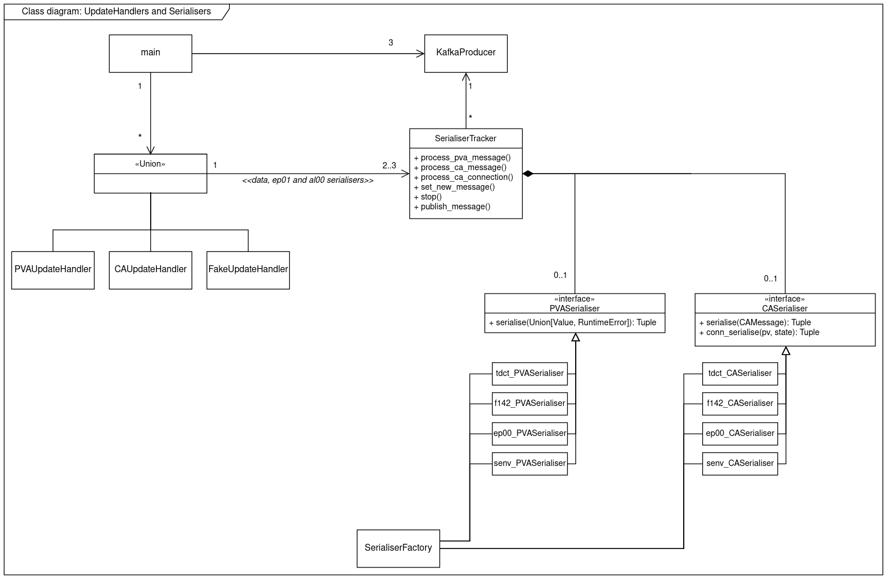

# Developer notes

## Streaming data types

The forwarder makes use of the following
[streaming-data-types](https://github.com/ess-dmsc/streaming-data-types)
schemas for encoding its data output and receiving configuration commands:

* *Data schemas* like `f144`, `se00` and `tdct` to encode data from EPICS updates.
* `ep01` to forward EPICS connection/disconnection events.
  Messages with this schema are automatically forwarded for all compatible
  data schemas (e.g. `f144`, `se00`, `tdct`).
* `al00` to forward EPICS alarms.
  Messages with this schema are automatically forwarded for all compatible
  data schemas (e.g. `f144`, `se00`, `tdct`).
* `x5f2` is used by the forwarder to push runtime status updates that can be
  used for monitoring.
* `rf5k` is a control message used to add/remove EPICS PVs to/from the 
  forwarder's configuration. See the README section
  *Configuring EPICS PVs to be forwarded* for more information. 

## Periodic updates

The forwarder is designed to cache the last value received on all
configured PVs and continuously forward this value to Kafka.
This ensures that the last-known value is always available in the recent
history of the Kafka topic, even if the last value change at the EPICS layer 
ocurred far in the past.

The period of these repeated updates is a global setting set via the
`--pv-update-period` argument.

The cache and updates are managed by the `SerialiserTracker` class.

## Class diagrams

### UpdateHandlers and Serialisers

